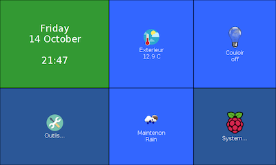
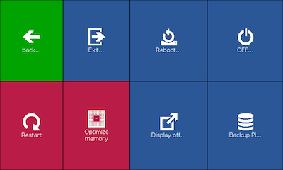
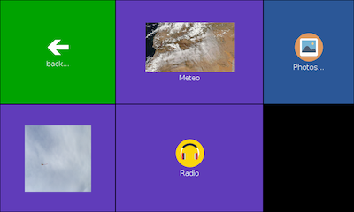

PiMenu
======

This is a fork of pimenu from splitbrain (a simple fullscreen menu system written in Python TKInter). 

It has been developed with a Raspberry Pi 3 with his Official Touchscreen (7'').

The design is inspired by Windows 8's Metro design. Tiles are configured in
```pimenu.yaml```, they can either open new pages of tiles or execute actions 
(in script ```pimenu.sh``` or from a function in ```pimenu_user.py```) to execute arbitrary tasks.

Prerequesite
------------

On the Raspberry, install:

- python-yaml with apt-get
- pillow module with pip
- webbrowser with pip (optional)
- psutil with pip (optional)
- requests with pip


The app can be started in fullscreen by passing ```fs``` as first parameter.






What's new ?
------------

In the configuration file ```pimenu.yaml``` a few new parameters (all optional):

- ```font```: button text font
- ```title```: first button text line (not editable in the user script)
- ```icon```: gif or ppm image from an url (http, https) or from the ico directory
- ```image```: png or jpg image from an url (http, https) or from the ico directory
- ```imgheight```, ```imgwidth```: size of the ```image```
- ```user``` (optional): used when an event occured ("onconfigure", "onclick" or "onrefresh")
  - ```func```: callable function in ```pimenu_user.py```. 
    - Syntax ```def slideshow_info(val, params, action):```
    - var ```val```: mixed variable
    - var ```params```: dict of params (see bellow)
    - var ```action```: "onconfigure", "onclick" or "onrefresh" depending on the action
    - You have to return an array ```[update of val, state of the button True/False, {dict of parameters to update like label, icon...} ]```
  - ```refresh```: call the function every x milliseconds
  - ```params```: free parameters that will be passed to user function
  - ```label```, ```icon```, ```font```, ```image```, ```imgheight```, ```imgwidth```: the same 


License
-------

Copyright (c) 2014 Andreas Gohr

Permission is hereby granted, free of charge, to any person obtaining a copy
of this software and associated documentation files (the "Software"), to deal
in the Software without restriction, including without limitation the rights
to use, copy, modify, merge, publish, distribute, sublicense, and/or sell
copies of the Software, and to permit persons to whom the Software is
furnished to do so, subject to the following conditions:

The above copyright notice and this permission notice shall be included in
all copies or substantial portions of the Software.

THE SOFTWARE IS PROVIDED "AS IS", WITHOUT WARRANTY OF ANY KIND, EXPRESS OR
IMPLIED, INCLUDING BUT NOT LIMITED TO THE WARRANTIES OF MERCHANTABILITY,
FITNESS FOR A PARTICULAR PURPOSE AND NONINFRINGEMENT. IN NO EVENT SHALL THE
AUTHORS OR COPYRIGHT HOLDERS BE LIABLE FOR ANY CLAIM, DAMAGES OR OTHER
LIABILITY, WHETHER IN AN ACTION OF CONTRACT, TORT OR OTHERWISE, ARISING FROM,
OUT OF OR IN CONNECTION WITH THE SOFTWARE OR THE USE OR OTHER DEALINGS IN
THE SOFTWARE.

Icons
-----

The install comes wih a bunch of icons with their own licenses as listed below:

* bunny.gif     CC-by   http://thenounproject.com/term/rabbit/26062/
* invoice.gif   CC-by   http://thenounproject.com/term/invoice/60884/
* ambulance.gif PD      http://thenounproject.com/term/ambulance/597/
* medical.gif   CC-by   http://thenounproject.com/term/medical/35773/
* grave.gif     CC-by   http://thenounproject.com/term/grave/29403/
* fish.gif      CC-by   http://thenounproject.com/term/fish/19775/
* all others    CC-by   http://modernuiicons.com/
